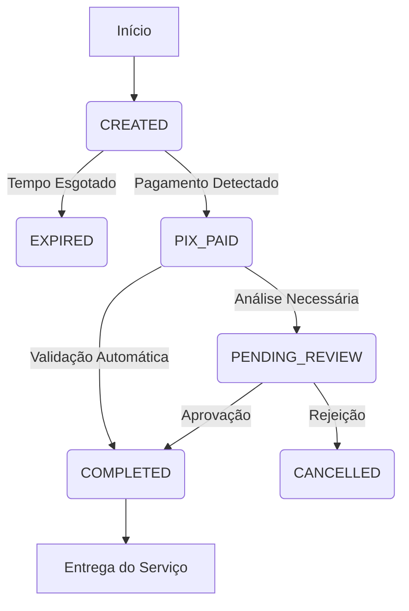

# Status Lifecycle

As transações no FlowPay seguem um ciclo de vida previsível. Entender esses estados é fundamental para saber quando liberar um serviço ou aguardar uma conciliação.

## Tabela de Estados

| Status | Significado | Ação do Integrador |
|:---|:---|:---|
| `CREATED` | A cobrança foi gerada e o QR Code está disponível para o cliente. | Exibir o QR Code e aguardar o pagamento. |
| `PIX_PAID` | O pagamento PIX foi detectado pelo banco/gateway. | Opcional: Mostrar "Pagamento Recebido" na UI. Aguardar processamento. |
| `PENDING_REVIEW` | O pagamento foi capturado, mas aguarda uma revisão de segurança ou liquidez (Raro). | Aguardar. Não liberar o produto ainda. |
| `COMPLETED` | **Sucesso Final.** O pagamento foi validado e a transação está concluída. | **Liberar o acesso, provisionar serviço ou enviar produto.** |
| `EXPIRED` | O tempo limite para pagamento (geralmente 1h) foi atingido. | Redirecionar o usuário para criar uma nova cobrança. |
| `CANCELLED` | A transação foi cancelada manualmente ou pelo sistema de fraude. | Não liberar o serviço e marcar como cancelada internamente. |

---

## Fluxo Visual

## Regras de Negócio Importantes

1. **Confiança**: Somente considere o pagamento garantido quando o status mudar para **`COMPLETED`**. 
2. **Webhooks**: Mudanças de status são notificadas via webhook. Sua aplicação deve ouvir especificamente pelo evento que marca a transição para `COMPLETED`.
3. **Consulta Ativa**: Em caso de falha no recebimento do webhook, você pode consultar o status via `GET /api/charge/:id` para reconciliação manual.
